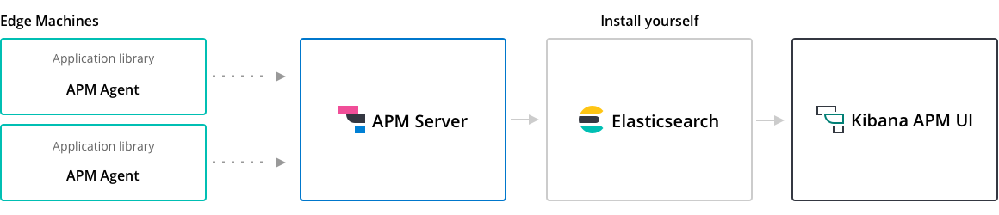

+++
title = '前端性能监控工具之APM Server'
date = 2023-11-06T22:07:01+08:00
draft = false
categories = ['前端']
tags = ['性能监控', 'ELK', 'Elastic Search']
series = ['前端性能监控']
series_order = 1
+++

## 官方文档
- [elastic organization github homepage](https://github.com/elastic)
- [APM Agents](https://www.elastic.co/guide/en/apm/agent/index.html)
- [Legacy APM Server](https://www.elastic.co/guide/en/apm/server/7.15/installing.html)
- [Elasticsearch](https://www.elastic.co/guide/en/elastic-stack-get-started/7.15/get-started-elastic-stack.html#install-elasticsearch)
- [Kibana](https://www.elastic.co/guide/en/elastic-stack-get-started/7.15/get-started-elastic-stack.html#install-kibana)
- [APM Real User Monitoring JavaScript Agent(Angular integration)](https://www.elastic.co/guide/en/apm/agent/rum-js/current/angular-integration.html)
- [Run APM Server on Docker](https://www.elastic.co/guide/en/apm/server/7.15/running-on-docker.html#running-on-docker)

传统的安装部分可以跳过，因为现在一般都是安装在docker上，我们可以直接使用官方或者第三方已经写好的dockerfile等文件替代传统的安装方式。

## Q: What is APM?
A: Free and open application performance monitoring

> Elastic APM is an application performance monitoring system built on the Elastic Stack. It allows you to monitor software services and applications in real-time, by collecting detailed performance information on response time for incoming requests, database queries, calls to caches, external HTTP requests, and more. This makes it easy to pinpoint and fix performance problems quickly.
> Elastic APM also automatically collects unhandled errors and exceptions. Errors are grouped based primarily on the stack trace, so you can identify new errors as they appear and keep an eye on how many times specific errors happen.
> Metrics are another vital source of information when debugging production systems. Elastic APM agents automatically pick up basic host-level metrics and agent-specific metrics, like JVM metrics in the Java Agent, and Go runtime metrics in the Go Agent.
## APM Server
APM Server是elastic家推出的前端性能监控方案的组成部分。它接收从Elastic APM agents发送来的信息并转发到Elasticsearch documents中存储，最后在Kibana中进行性能指标的可视化。

